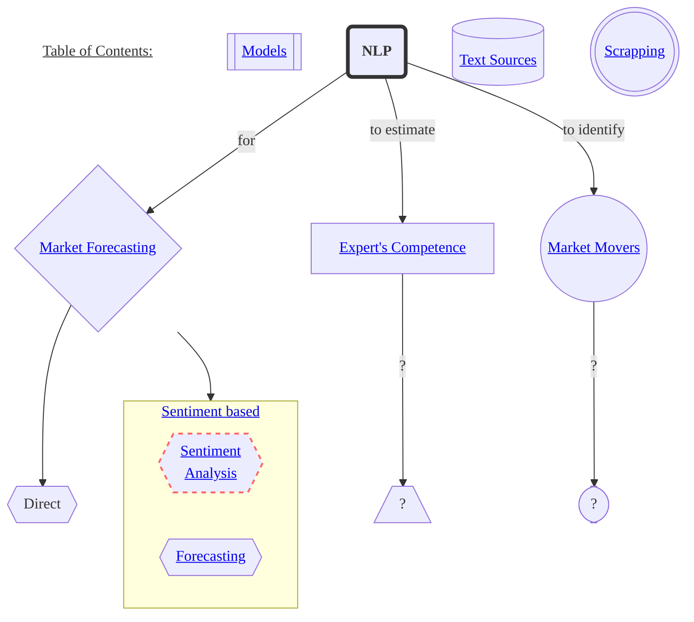
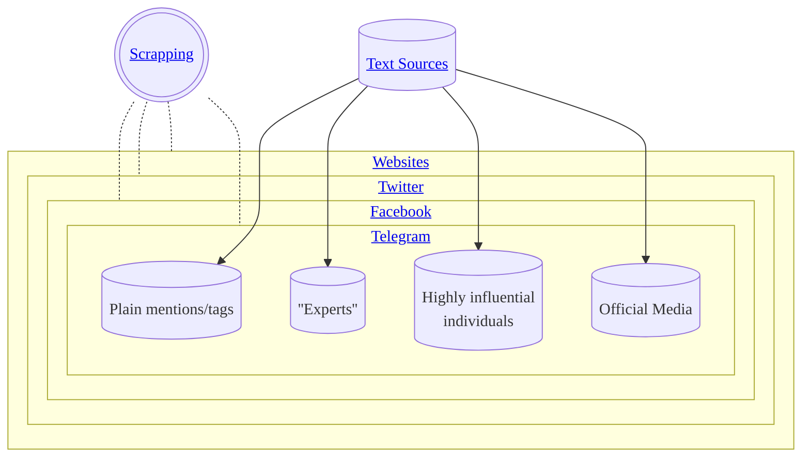

<!-- inspired by https://github.com/ryanzhumich/Contrastive-Learning-NLP-Papers -->
<!-- make read me prettier:  -->
<!-- todo list https://docs.github.com/ru/get-started/writing-on-github/working-with-advanced-formatting/about-task-lists#about-task-lists -->
<!-- emojies https://github.com/chroline/well_app/blob/main/README.md -->
<!-- tables https://github.com/ArmynC/ArminC-AutoExec/#readme -->
<!-- pic https://github.com/karan/joe#readme -->
## Research on all kinds of NLP for market forecasting, experts estimation, etc.

# Models
- __FinBert: A Large Language Model for Extracting Information from Financial Text__ `2019-2022` <i> Allen H. Huanga, Hui Wang, Yi Yang</i> [[pdf]](https://papers.ssrn.com/sol3/papers.cfm?abstract_id=3910214) [[repo]](https://github.com/yya518/FinBERT) [[website]](https://finbert.ai/)
# 1. Market Forecasting
Projection of the market states (high/low volatility, up/down index movements).
## Sentiment Based
- __Predicting the Stock Market with Sentiment Analysis of Newspaper Text__ <i>Juan Luis Ruiz-Tagle</i> `2020` [[thesis draft]](https://github.com/juanluisrto/stock-prediction-nlp/blob/master/memoria/Juan%20Luis%20Ruiz-Tagle%2018-Mayo_memoria_2/Master_Thesis_memoria_v2.pdf) [[repo]](https://github.com/juanluisrto/stock-prediction-nlp)

> __Text source:__ newspapers  
> __Sentiment model:__ BERT  
> __Predictions model:__ LSTM?  
  
_Claimed predictions for Tesla based solely on newspaper text_

<!-- https://youtu.be/G5ycs1hFSKk -->
<!-- https://github.com/pvanand07/NIFTY50-Daily-Trend-Prediction-Using-NLP-Python -->
<!-- finbert https://github.com/juanluisrto/stock-prediction-nlp/blob/master/memoria/papers/FinBERT.pdf -->
<!-- https://github.com/search?o=desc&q=nlp+for+stock&s=updated&type=Repositories -->
<!-- https://github.com/yiaktan/NLP-Stock-Prediction -->
### Sentiment Analysis
__Models__  
[__Hugging Face Hub #financial-sentiment-analysis__](https://huggingface.co/models?other=financial-sentiment-analysis)

<!-- - __Fine-tuned LM__ -->
### Forecasting

#### Algorithms
# 2. Expert's Competence Estimation
Ranking experts, qualification of experts, based on their past predictions/performance. 

# 3. Market Movers Identification
Market moving information is a term used in stock market investing, defined as __information that would cause any reasonable investor to make a buy or sell decision__. ([Wikipedia](https://en.wikipedia.org/wiki/Market_moving_information))  

# Text Sources
`To be added`

# Scrapping

## Websites
`To be added`
## Twitter
`To be added`
## Facebook
`To be added`
## Telegram
`To be added`

