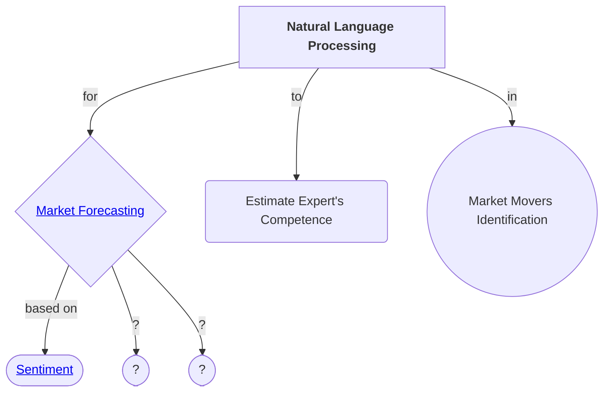

## Paper List on all kinds of NLP for market forecasting, experts estimation, etc.

# Market Forecasting
## Sentiment Based
- __Predicting the Stock Market with Sentiment Analysis of Newspaper Text__ <i>Juan Luis Ruiz-Tagle</i> `2020` [[thesis draft]](https://github.com/juanluisrto/stock-prediction-nlp/blob/master/memoria/Juan%20Luis%20Ruiz-Tagle%2018-Mayo_memoria_2/Master_Thesis_memoria_v2.pdf) [[repo]](https://github.com/juanluisrto/stock-prediction-nlp)

> _Text source: newspapers_  
> _Sentiment model: BERT_  
> _Predictions model: LSTM?_  
  
_Claimed predictions for Tesla based solely on newspaper text_

