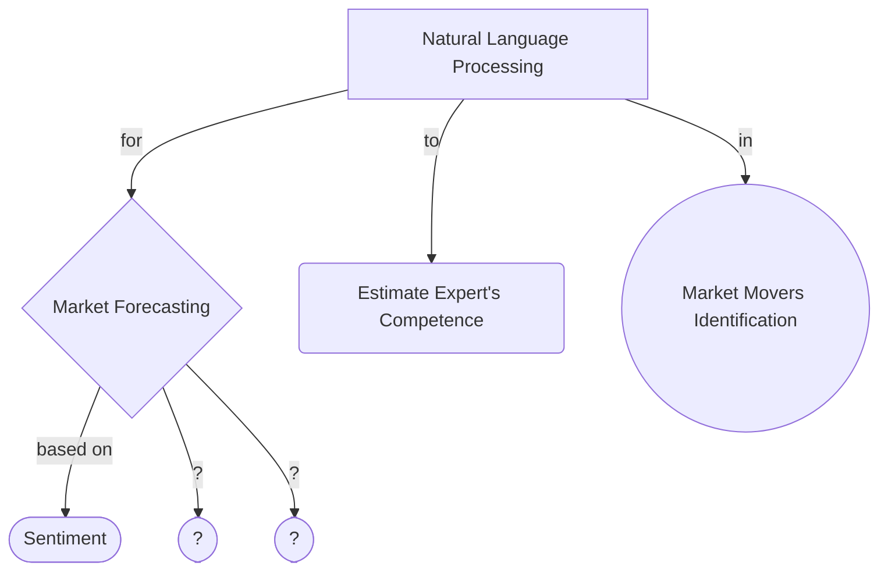

### Paper List on all kind of NLP in market forecasting, expert estimation and etc.

# Market Forecasting
## Sentiment Based
- __papers__: 
- __repositories__: 
> [stock-prediction-nlp](https://github.com/juanluisrto/stock-prediction-nlp) by Juan Luis Ruiz-Tagle
