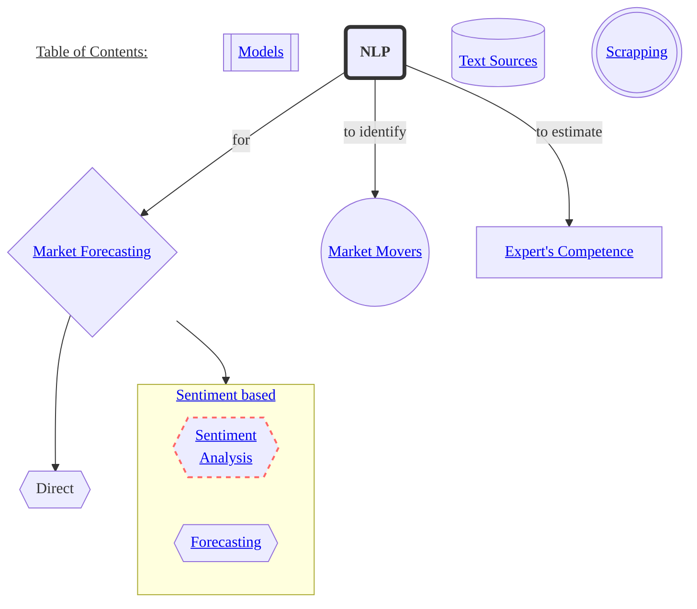
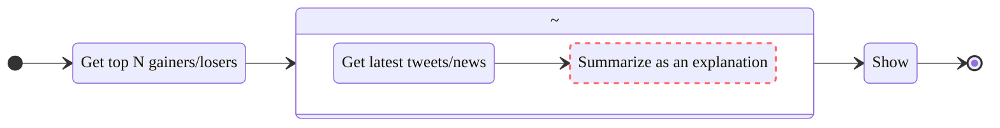
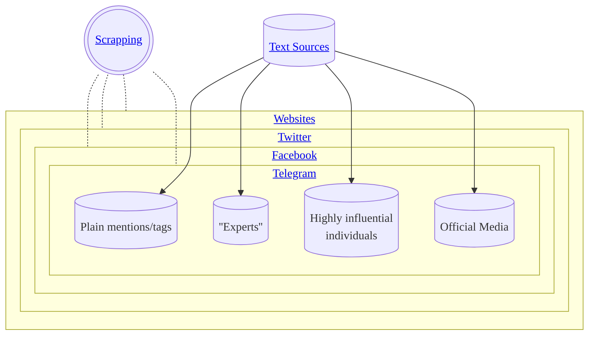

<!-- inspired by https://github.com/ryanzhumich/Contrastive-Learning-NLP-Papers -->
<!-- make read.me prettier:  -->
<!-- todo list https://docs.github.com/ru/get-started/writing-on-github/working-with-advanced-formatting/about-task-lists#about-task-lists -->
<!-- emojies https://github.com/chroline/well_app/blob/main/README.md -->
<!-- tables https://github.com/ArmynC/ArminC-AutoExec/#readme -->
<!-- pic https://github.com/karan/joe#readme -->
## Research on all kinds of NLP for market forecasting, experts estimation, etc.

# Models
- __FinancialBERT - A Pretrained Language Model for Financial Text Mining__ `2022` <i>Ahmed Rachid Hazourli</i> [[pdf]](https://www.researchgate.net/publication/358284785_FinancialBERT_-_A_Pretrained_Language_Model_for_Financial_Text_Mining) [[demo]](https://huggingface.co/ahmedrachid/FinancialBERT)
- __FinBert - A Large Language Model for Extracting Information from Financial Text__ `2019-2022` <i> Allen H. Huanga, Hui Wang, Yi Yang</i> [[pdf]](https://papers.ssrn.com/sol3/papers.cfm?abstract_id=3910214) [[repo]](https://github.com/yya518/FinBERT) [[website]](https://finbert.ai/) [[demo]](https://huggingface.co/ProsusAI/finbert)
- __NFinBERT: A Number-Aware Language Model for Financial Disclosures__ `2021` <i>Hao-Lun Lin and Jr-Shian Wu, Yu-Shiang Huang, Ming-Feng Tsai, Chuan-Ju Wang</i> [[pdf]](https://ceur-ws.org/Vol-2957/paper5.pdf)
# 1. Market Forecasting
Projection of the market states (high/low volatility, up/down index movements).
<!-- Survey https://www.mdpi.com/2078-2489/13/10/466 -->
## Sentiment Based
- __Predicting the Stock Market with Sentiment Analysis of Newspaper Text__ <i>Juan Luis Ruiz-Tagle</i> `2020` [[master thesis (draft)]](https://github.com/juanluisrto/stock-prediction-nlp/blob/master/memoria/Juan%20Luis%20Ruiz-Tagle%2018-Mayo_memoria_2/Master_Thesis_memoria_v2.pdf) [[repo]](https://github.com/juanluisrto/stock-prediction-nlp)

> __Text source:__ newspapers  
> __Sentiment model:__ BERT  
> __Predictions model:__ LSTM?  
  
_Claimed predictions for Tesla based solely on newspaper text_

<!-- https://youtu.be/G5ycs1hFSKk -->
<!-- https://github.com/pvanand07/NIFTY50-Daily-Trend-Prediction-Using-NLP-Python -->
<!-- finbert https://github.com/juanluisrto/stock-prediction-nlp/blob/master/memoria/papers/FinBERT.pdf -->
<!-- https://github.com/search?o=desc&q=nlp+for+stock&s=updated&type=Repositories -->
<!-- https://github.com/yiaktan/NLP-Stock-Prediction -->
### Sentiment Analysis
__Models__  
[__Hugging Face Hub #financial-sentiment-analysis__](https://huggingface.co/models?other=financial-sentiment-analysis)

<!-- - __Fine-tuned LM__ -->
### Forecasting
#### Algorithms
`To be added`

## Interpretability
Essentially we want an answer to a question "what..", but can we as well know "why"? 
Is this problem related to long-form question-answering (LFQA)? I don't know. If so, here's something to read: 
- __WebGPT: Browser-assisted question-answering with human feedback__ `2021` <i>OpenAI</i> [[blog]](https://openai.com/blog/webgpt) [[pdf]](https://arxiv.org/abs/2112.09332) [[demo]](https://openaipublic.blob.core.windows.net/webgpt-answer-viewer/index.html) + the [explanation](https://habr.com/ru/company/ods/blog/709222/) on habr (by [@stalkermustang](https://github.com/stalkermustang) I presume)  
- __GopherCite: Teaching language models to support answers with verified quotes__ `2022` <i>DeepMind</i> [[blog]](https://www.deepmind.com/blog/gophercite-teaching-language-models-to-support-answers-with-verified-quotes) [[pdf]](https://storage.googleapis.com/deepmind-media/Teaching%20language%20models%20to%20support%20answers%20with%20verified%20quotes/Teaching%20language%20models%20to%20support%20answers%20with%20verified%20quotes.pdf) 
- (And obviously) __Toolformer: Language Models Can Teach Themselves to Use Tools__ `2023` <i>Meta</i> [[pdf]](https://arxiv.org/pdf/2302.04761.pdf) 

Can the task of prediction can be solved as collateral to the Market Movers identification?
# 2. Market Movers Identification
Market moving information is a term used in stock market investing, defined as __information that would cause any reasonable investor to make a buy or sell decision__. ([Wikipedia](https://en.wikipedia.org/wiki/Market_moving_information))  

Example of a stock mover identification taken from [Benzinga](https://www.benzinga.com/apis/cloud-product/bz-why-is-it-moving/):  
  

__How can such pipeline look:__

# 3. Expert's Competence Estimation
Ranking experts, qualification of experts, based on their past predictions/performance. 

# Tools
__Pythonic ways to download market data from__ [Yahoo!Ⓡ finance](https://finance.yahoo.com/): 
[yfinance](https://pypi.org/project/yfinance/) 
[yahooquery](https://pypi.org/project/yahooquery/2.2.5/) 

# Text Sources

# Scrapping
`To be added`
## Websites
`To be added`
## Twitter
`To be added`
## Facebook
`To be added`
## Telegram
`To be added`

## 🤝 Contributing

Contributions, issues and feature requests are welcome.

