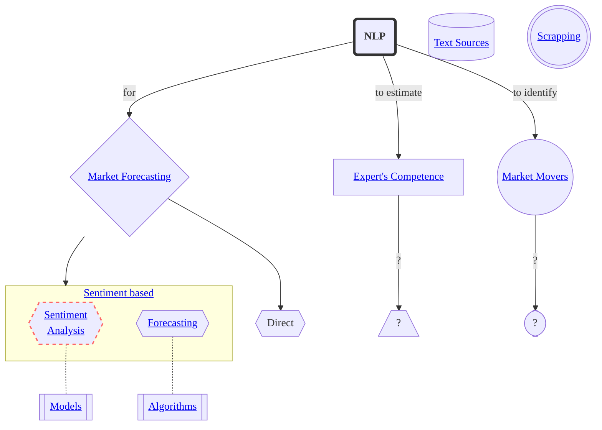
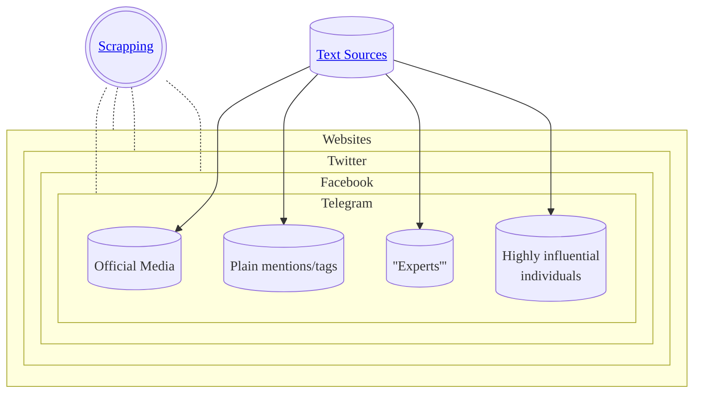

<!-- inspired by https://github.com/ryanzhumich/Contrastive-Learning-NLP-Papers -->
<!-- make read me prettier:  -->
<!-- todo list https://docs.github.com/ru/get-started/writing-on-github/working-with-advanced-formatting/about-task-lists#about-task-lists -->
<!-- emojies https://github.com/chroline/well_app/blob/main/README.md -->
<!-- tables https://github.com/ArmynC/ArminC-AutoExec/#readme -->
<!-- pic https://github.com/karan/joe#readme -->
## Research on all kinds of NLP for market forecasting, experts estimation, etc.

# Market Forecasting
## Sentiment Based
- __Predicting the Stock Market with Sentiment Analysis of Newspaper Text__ <i>Juan Luis Ruiz-Tagle</i> `2020` [[thesis draft]](https://github.com/juanluisrto/stock-prediction-nlp/blob/master/memoria/Juan%20Luis%20Ruiz-Tagle%2018-Mayo_memoria_2/Master_Thesis_memoria_v2.pdf) [[repo]](https://github.com/juanluisrto/stock-prediction-nlp)

> _Text source: newspapers_  
> _Sentiment model: BERT_  
> _Predictions model: LSTM?_  
  
_Claimed predictions for Tesla based solely on newspaper text_

<!-- https://youtu.be/G5ycs1hFSKk -->
<!-- https://github.com/pvanand07/NIFTY50-Daily-Trend-Prediction-Using-NLP-Python -->
<!-- finbert https://github.com/juanluisrto/stock-prediction-nlp/blob/master/memoria/papers/FinBERT.pdf -->
<!-- https://github.com/search?o=desc&q=nlp+for+stock&s=updated&type=Repositories -->
<!-- https://github.com/yiaktan/NLP-Stock-Prediction -->
### Sentiment Analysis
### Forecasting

# Expert's Competence Estimation
`To be added`

# Market Movers Identification
`To be added`

# Text Sources
`To be added`

# Scrapping
`To be added`

